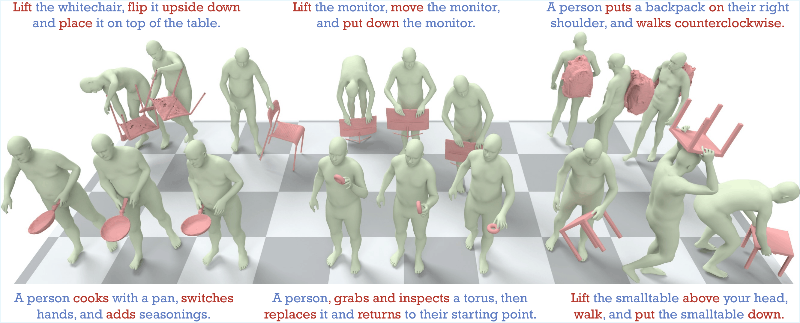

<div align="center">

# **Unleashing Guidance Without Classifiers for Human-Object Interaction Animation**

[Ziyin Wang](https://github.com/wzyabcas)<sup>1</sup>&emsp; [Sirui Xu](https://sirui-xu.github.io)<sup>1</sup>&emsp; [Chuan Guo](https://ericguo5513.github.io/)<sup>2</sup>&emsp; [Bing Zhou](https://zhoubinwy.github.io/)<sup>2</sup>&emsp; [Jiangshan Gong](https://github.com/gong208)<sup>1</sup>&emsp; [Jian Wang](https://jianwang-cmu.github.io/)<sup>2</sup>&emsp; [Yu-Xiong Wang](https://yxw.cs.illinois.edu/)<sup>1</sup>&emsp; [Liang-Yan Gui](https://lgui.web.illinois.edu/)<sup>1</sup>

<sup>1</sup>University of Illinois Urbana-Champaign<br>
<sup>2</sup>Snap Inc.<br>

**ICLR 2026**

</div>

</p>
<p align="center">
  <a href='https://arxiv.org/pdf/2603.25734'>
    </a>
  <!-- <a href='https://arxiv.org/pdf/xxxx.xxxxx.pdf'>
    </a> -->
<a href='https://ziyinwang1.github.io/LIGHT/'>
    </a> 
  <a href='https://github.com/wzyabcas/LIGHT'>
    </a>
</p>




## News
- [2026-03-27] Initial release of LIGHT.
- [2026-03-27] Release the inference pipeline.
- [2026-04-22] Release the training pipeline.
- [2026-04-22] Release the evaluation pipeline.
- [2026-04-22] Release the evaluator and pretrained model checkpoints


## TODO
- [X] Release the checkpoints on all datasets
- [X] Release the evaluation pipeline
- [X] Release the training pipeline
- [ ] Release the data processing code for GRAB and BEHAVE
- [ ] Release the augmentated data


## General Description

  We introduce LIGHT, a pipeline that generates realistic human-object interaction animations by denoising different components of the motion at different speeds, so cleaner components naturally guide noisier ones - producing contact-aware guidance without any external classifiers or hand-crafted priors.


## Preparation

<details>
  <summary>Please follow these steps to get started</summary>

  1. Download SMPL+H and SMPL-X. 

     Download SMPL+H mode from [SMPL+H](https://mano.is.tue.mpg.de/download.php) (choose Extended SMPL+H model used in the AMASS project), DMPL model from [DMPL](https://smpl.is.tue.mpg.de/download.php) (choose DMPLs compatible with SMPL), and SMPL-X model from [SMPL-X](https://smpl-x.is.tue.mpg.de/download.php). Then, please place all the models under `./models/`. The `./models/` folder tree should be: 

     ````
     models
     │── smplh
     │   ├── female
     │   │   ├── model.npz
     │   ├── male
     │   │   ├── model.npz
     │   ├── neutral
     │   │   ├── model.npz
     │   ├── SMPLH_FEMALE.pkl
     │   ├── SMPLH_MALE.pkl
     │   └── SMPLH_NEUTRAL.pkl    
     └── smplx
         ├── SMPLX_FEMALE.npz
         ├── SMPLX_FEMALE.pkl
         ├── SMPLX_MALE.npz
         ├── SMPLX_MALE.pkl
         ├── SMPLX_NEUTRAL.npz
         └── SMPLX_NEUTRAL.pkl
     ````
     
     Please follow [smplx tools](https://github.com/vchoutas/smplx/blob/main/tools/README.md#merging-smpl-h-and-mano-parameters) to merge SMPL-H and MANO parameters.

2. Prepare Environment

  - Create and activate a fresh environment:
    ```bash
    conda create -n light python=3.10
    conda activate light
    pip install torch==2.5.1 torchvision==0.20.1 torchaudio==2.5.1 --index-url https://download.pytorch.org/whl/cu118
    ```

    To install PyTorch3D, please follow the official instructions: [Pytorch3D](https://github.com/facebookresearch/pytorch3d/blob/main/INSTALL.md).

    Install remaining packages:
    ```
    pip install -r requirements.txt
    ```

3. Prepare data

    Download the processed dataset from this [link](https://drive.google.com/file/d/1-A2NuyyRydUkwAm-rDTHhBHnV8YnJ4uO/view?usp=sharing)

    Expected File Structure:
    ```bash
    InterAct/dataset_name
    ├── objects
    │   └── object_name
    │       └── object_name.obj
    └── sequences_canonical
      └── id
        ├── data.npz
    ```
4. Download pretrained checkpoints


    Download the pretrained checkpoints from this [link](https://drive.google.com/file/d/142UBxI1XyGVeopk0_azD_B_FDE_HPS8J/view?usp=sharing), and put in `./save/`. 

5. Download evaluator checkpoint


    Download the evaluator checkpoints from this [link](https://drive.google.com/file/d/1vajAJV6ma9elAl2802coX62-k2wnTLjZ/view?usp=sharing), and put in `./assets/evaluator.ckpt`.


</details>

## Inference


To inference with trained models, execute the following steps

  - Generate without guidance:

    ```
    bash ./scripts/generate.sh --dataset DATASET
    ```
  - Generate with our guidance:

    ```
    bash ./scripts/generate_guide.sh --dataset DATASET --mode GUIDANCE_MODE
    ```

    </details>
  `DATASET` is from `[omomo, behave, interact]`. `GUIDANCE_MODE` ranges from 0 to 5, corresponding to the following $(m_1, m_2)$ combinations in the paper:

  | GUIDANCE_MODE | $m_1$  | $m_2$  |
  |---------------|-----|-----|
  | 0             | o, h | b   |
  | 1             | b, h | o   |
  | 2             | b, o | h   |
  | 3             | b   | o, h |
  | 4             | o   | b, h |
  | 5             | h   | b, o |

## Evaluation


To evaluate with trained models, execute the following steps

  - Evaluate without guidance:

    ```
    bash ./scripts/eval.sh --dataset DATASET
    ```

  - Evaluate with our guidance:

    ```
    bash ./scripts/eval_guide.sh --dataset DATASET --mode GUIDANCE_MODE
    ```
    </details>
  `DATASET` is from `[omomo, behave, interact]`. `GUIDANCE_MODE` ranges from 0 to 5, corresponding to the following $(m_1, m_2)$ combinations in the paper:

  | GUIDANCE_MODE | $m_1$  | $m_2$  |
  |---------------|-----|-----|
  | 0             | o, h | b   |
  | 1             | b, h | o   |
  | 2             | b, o | h   |
  | 3             | b   | o, h |
  | 4             | o   | b, h |
  | 5             | h   | b, o |


## Training


To train the model, execute the following steps

```
bash ./scripts/train.sh --dataset DATASET
```
`DATASET` is from `[omomo, imhd, neuraldome, chairs]`. Training on BEHAVE, GRAB and InterAct datasets will be supported soon.

## Citation  

If you find this repository useful for your work, please cite:

```bibtex
@inproceedings{wang2026unleashing,
      title = {Unleashing Guidance Without Classifiers for Human-Object Interaction Animation},
      author = {Wang, Ziyin and Xu, Sirui and Guo, Chuan and Zhou, Bing and Gong, Jiangshan and Wang, Jian and Wang, Yu-Xiong and Gui, Liang-Yan},
      booktitle = {ICLR},
      year = {2026}
    }
```

Please also consider citing the InterAct benchmark that we built our model upon:
```bibtex
@inproceedings{xu2025interact,
    title     = {{InterAct}: Advancing Large-Scale Versatile 3D Human-Object Interaction Generation},
    author    = {Xu, Sirui and Li, Dongting and Zhang, Yucheng and Xu, Xiyan and Long, Qi and Wang, Ziyin and Lu, Yunzhi and Dong, Shuchang and Jiang, Hezi and Gupta, Akshat and Wang, Yu-Xiong and Gui, Liang-Yan},
    booktitle = {CVPR},
    year      = {2025}}

```
